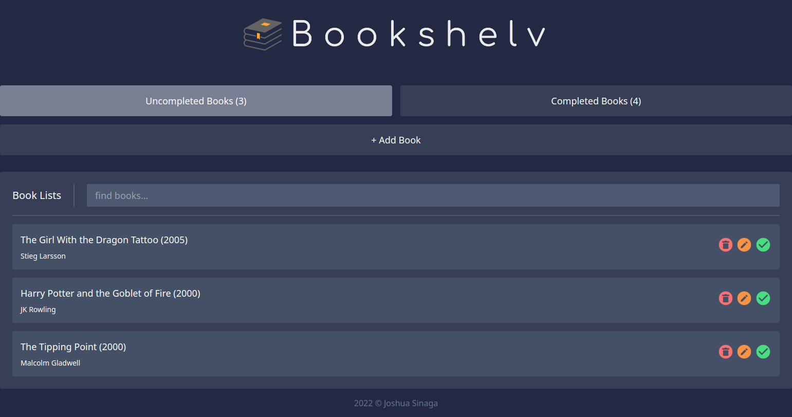

<h1 align="center">Bookshelv</h1>

  

    Bookshelv is a simple website to organize books that have been read. built with only HTML, CSS and javascript.

## Details
* #### JS Libraries
    * <a href="https://sweetalert2.github.io/">SweetAlert2</a>
    * <a href="https://carlosroso.com/notyf/">Notyf</a>
* #### CSS Framework
    * <a href="https://tailwindcss.com/">TailwindCSS</a>

## App
Demo : [Bookshelv]()

## Preview

## Note
this project was used to fulfill the submission of the [Belajar Membuat Front-End Web untuk Pemula](https://www.dicoding.com/academies/315) class in Dicoding. And don't plagiarize this project for your class submission :)

Feel free to contribute to this repository!

## Credit
* ### Joshua Sinaga